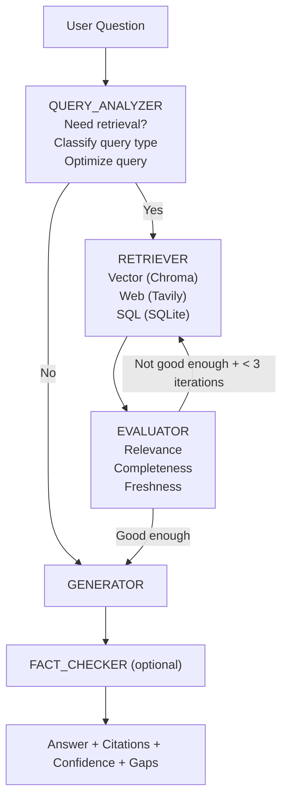

# agentic-rag-engine

Traditional RAG retrieves blindly. Agentic RAG retrieves intelligently.

## Quick Start

```bash
cd "/Users/sairammaruri/Documents/New git projects/Agentic RAG Engine"
chmod +x all_in_once.sh
./all_in_once.sh --python python3.13
```

`agentic-rag-engine` is a Python system where an LLM agent decides:
- if retrieval is needed,
- what query to retrieve with,
- which source(s) to consult,
- whether results are good enough,
- and when to re-query.

This implements the production loop: `retrieve -> evaluate -> refine -> re-retrieve`.

## Why this pattern

Traditional RAG retrieves on every query. Agentic RAG is smarter: it only retrieves when needed and adapts retrieval strategy in-flight. This is the enterprise RAG pattern for 2026.

## Decision Flow



## Architecture (LangGraph)

State keys:
- `query`
- `retrieved_docs`
- `evaluation`
- `answer`
- `sources`
- `iteration_count`

Nodes:
1. `QUERY_ANALYZER`
2. `RETRIEVER`
3. `EVALUATOR`
4. `GENERATOR`
5. `FACT_CHECKER` (optional)

## Project Structure

```text
src/
  graph/
    state.py
    nodes.py
    workflow.py
  retrievers/
    vector.py
    web.py
    sql.py
  evaluators/
    relevance.py
    completeness.py
  api.py
  demo.py
examples/
tests/
README.md
LICENSE
CLAUDE.md
all_in_once.sh
torun.txt
```

## Stability Fixes Included

- Added API root route (`GET /`) so `localhost:<port>/` does not return 404.
- Fixed Streamlit import-path issues (`No module named 'src'`) by setting project root in `sys.path`.
- Added robust source normalization in query routing (handles case/spacing/duplicates).
- Hardened LLM JSON parsing (`"false"` now handled correctly as boolean false).
- Improved no-retrieval fallback answers (safe arithmetic evaluation instead of hardcoded responses).
- Improved startup script reliability:
  - automatic busy-port fallback,
  - startup health checks for FastAPI/Streamlit,
  - error log tail on startup failure,
  - Python executable selection with `--python`,
  - Python 3.14 compatibility warning and auto-switch to 3.13 when available.

## Setup

### 1) Install dependencies

```bash
pip install -r requirements.txt
```

### 2) Configure environment

```bash
export OPENAI_API_KEY="your-openai-key"
export TAVILY_API_KEY="your-tavily-key"
export OPENAI_MODEL="gpt-4.1-mini"
```

Notes:
- Without API keys, the engine still runs with deterministic fallbacks.
- Chroma persists in `data/chroma`.
- SQLite structured data is stored in `data/structured.db`.

## One-Command Run (Recommended)

```bash
chmod +x all_in_once.sh
./all_in_once.sh --python python3.13
```

Useful flags:

```bash
./all_in_once.sh --no-tests
./all_in_once.sh --api-port 9000 --demo-port 8601
./all_in_once.sh --python python3
```

What it does:
- creates/uses `.venv`,
- installs dependencies,
- runs tests,
- starts FastAPI + Streamlit,
- writes logs to `logs/api.log` and `logs/demo.log`.

## Manual Run

### Run API

```bash
uvicorn src.api:app --reload --host 127.0.0.1 --port 8000
```

Endpoints:
- `GET /`
- `GET /health`
- `POST /query`
- `POST /upload`
- `GET /docs`

### Run Streamlit Demo

```bash
streamlit run src/demo.py --server.port 8501 --server.headless true
```

Demo features:
- Upload PDF/TXT/MD documents
- Chat interface with citations
- Retrieval trace viewer
- Metrics: retrieval iterations, consulted sources, confidence

## Tests

```bash
pytest -q
```

## Example cURL

```bash
curl -X POST http://localhost:8000/query \
  -H "Content-Type: application/json" \
  -d '{"question":"What are the latest database benchmark trends in 2026?","sources":["web","vector"],"max_iterations":3}'
```

## Troubleshooting

- `{"detail":"Not Found"}` on `localhost:8000`:
  - use `/` or `/docs`; root route is now implemented.

- `No module named 'src'` in Streamlit:
  - fixed in code; rerun with latest files and project root working directory.

- Port already in use:
  - `all_in_once.sh` auto-selects next available port and prints it.

- `OPENAI_API_KEY` / `TAVILY_API_KEY` warnings:
  - set env vars for full LLM + web retrieval behavior.

- Python 3.14 warnings:
  - prefer `python3.13` for better compatibility with current dependency stack.

## Claude Code

See `CLAUDE.md` for Claude-focused quickstart commands and prompt templates for this repo.

## License

Apache License 2.0 (`LICENSE`).
